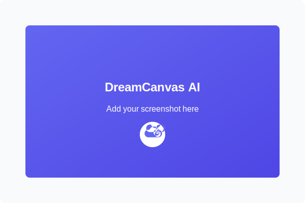

<div align="center">
  

  <p>Transform your ideas into stunning AI-generated images with just a text prompt</p>

  <p>
    <a href="https://github.com/omara2001/Image-Generator/stargazers">
      
    </a>
    <a href="https://github.com/omara2001/Image-Generator/network/members">
      
    </a>
    <a href="https://github.com/omara2001/Image-Generator/issues">
      
    </a>
    <a href="https://github.com/omara2001/Image-Generator/blob/main/LICENSE">
      
    </a>
  </p>

  <p>
    <a href="https://github.com/omara2001/Image-Generator/issues">Report Bug</a>
    ·
    <a href="https://github.com/omara2001/Image-Generator/issues">Request Feature</a>
  </p>
</div>

## ✨ Features

- 🎨 **Text-to-Image Generation** - Create beautiful images from text descriptions
- 📱 **Fully Responsive** - Works perfectly on all devices (mobile, tablet, desktop)
- 💾 **Image Download** - Save your generated images with one click
- 🚀 **Fast Generation** - Powered by Stable Diffusion XL via deployed Railway API
- 🔄 **Real-time Feedback** - See loading indicators and error messages
- 🌐 **Cross-Platform** - Works in all modern browsers

## 🖼️ Screenshots

<div align="center">
  <table>
    <tr>
      <td align="center">
        <strong>Desktop View</strong><br>
        
      </td>
    </tr>
    <tr>
      <td align="center">
        <strong>Mobile View</strong><br>
        
      </td>
    </tr>
  </table>
</div>

> **Note:** Replace the placeholder images with actual screenshots:
> 1. Take screenshots of your application on desktop and mobile devices
> 2. Save them as `screenshot-desktop.png` and `screenshot-mobile.png` in the project root 
> 3. Update the README.md file to point to your screenshots
> 4. Or use image hosting services like Imgur and update the image URLs


## 🛠️ Technologies Used

- **Frontend**:
  - HTML5, CSS3, JavaScript
  - Responsive design with media queries
  - Font Awesome for icons
  - Google Fonts (Poppins)

- **Backend**:
  - FastAPI (Python)
  - Hugging Face API (Stable Diffusion XL)
  - Railway for hosting

## 📋 Prerequisites

- For development: Python 3.8+ with FastAPI (backend) or serve the frontend with any HTTP server
- Live deployment already configured at: https://web-production-fffaa.up.railway.app/

## 🔧 Installation & Setup

1. **Clone the repository**

```bash
git clone https://github.com/omara2001/Image-Generator.git
cd Image-Generator
```

2. **Frontend Only Setup**

Simply open the `index.html` file in your browser, or serve it with any HTTP server of your choice.

3. **Testing the API**

The API is already deployed at https://web-production-fffaa.up.railway.app/

API Endpoints:
- Health check: GET https://web-production-fffaa.up.railway.app/
- Generate image: POST https://web-production-fffaa.up.railway.app/generate-image

Example request body for image generation:
```json
{
  "prompt": "A cat in the street",
  "width": 512,
  "height": 512,
  "num_inference_steps": 30,
  "guidance_scale": 7.5
}
```

## 🌐 Deployment

The application is deployed using:

- Frontend: GitHub Pages or any static hosting
- Backend: Railway at https://web-production-fffaa.up.railway.app/

## 📱 Responsive Design

DreamCanvas AI is designed to work seamlessly across all device sizes:

- **Mobile**: Optimized layout with stacked controls
- **Tablet**: Enhanced spacing and larger controls
- **Desktop**: Full-featured experience with optimal spacing

## 🔄 How It Works

1. Enter a text prompt describing the image you want to create
2. Click the "Generate" button or press Enter
3. Wait for the AI to generate your image
4. Download your image using the download button

The frontend sends a request to the Railway-hosted API, which uses Hugging Face's Stable Diffusion models to generate the image.

## 🤝 Contributing

Contributions are welcome! Here's how you can contribute:

1. Fork the repository
2. Create your feature branch (`git checkout -b feature/amazing-feature`)
3. Commit your changes (`git commit -m 'Add some amazing feature'`)
4. Push to the branch (`git push origin feature/amazing-feature`)
5. Open a Pull Request

## 📄 License

This project is licensed under the ISC License - see the [LICENSE](LICENSE) file for details.

## 👨‍💻 Author

- **Omar A** - [GitHub Profile](https://github.com/omara2001)

## 🙏 Acknowledgements

- [Hugging Face](https://huggingface.co/) for the AI models
- [Stable Diffusion](https://stability.ai/stable-diffusion) for the image generation technology
- [Railway](https://railway.app/) for hosting the backend
- [Font Awesome](https://fontawesome.com/) for the icons
- [Google Fonts](https://fonts.google.com/) for the Poppins font
